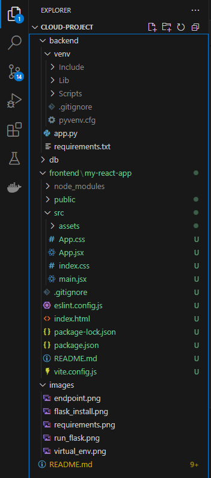
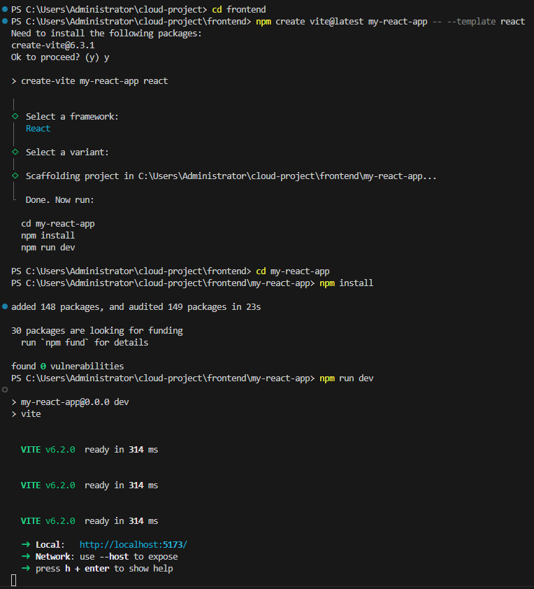
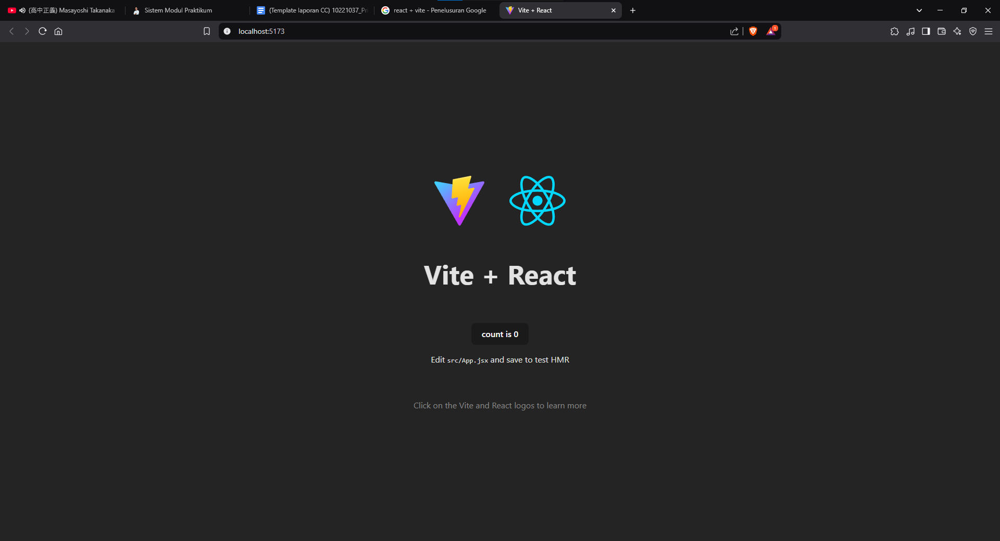
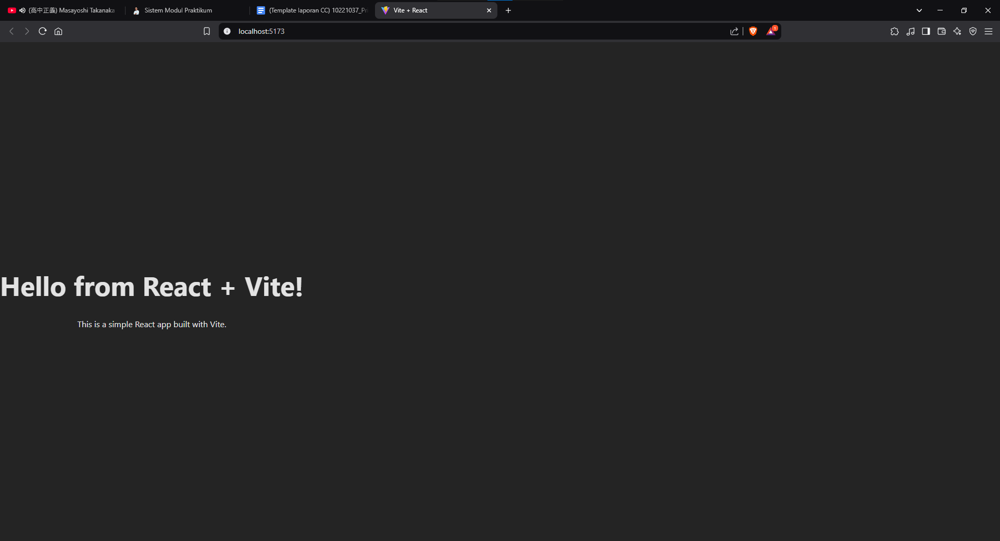
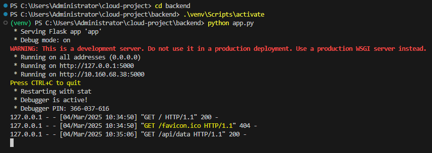
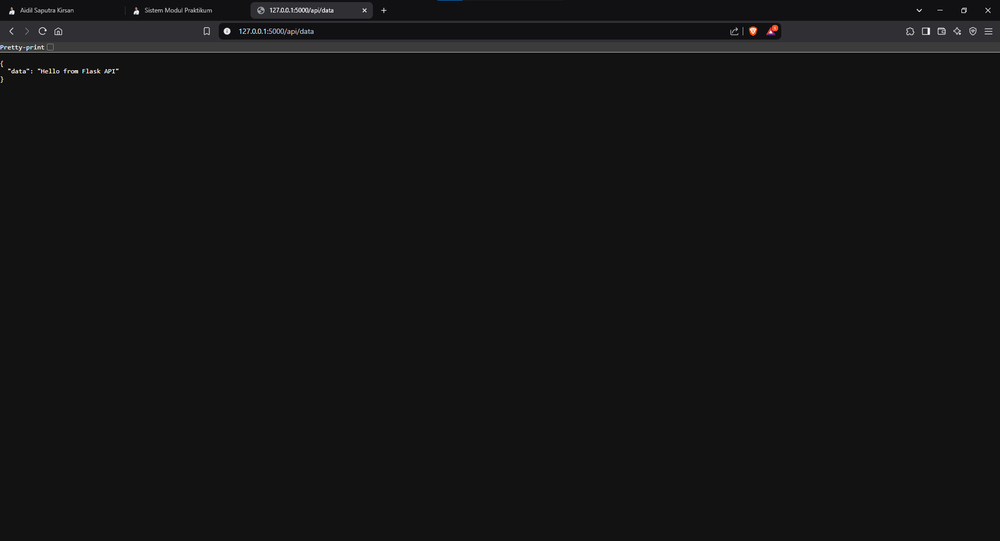
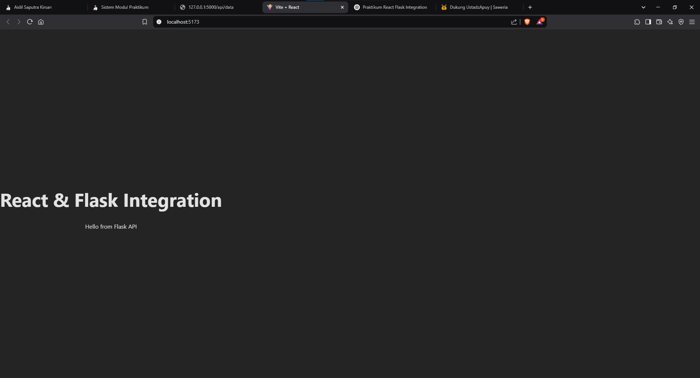

# Dokumentasi Praktikum - API Sederhana dengan Flask

## 📌 Deskripsi Singkat
Praktikum ini bertujuan untuk membuat API sederhana menggunakan Flask. Mahasiswa akan belajar tentang struktur dasar Flask, routing, dan cara menjalankan server lokal.

## 🎯 Tujuan Pembelajaran
- Memahami struktur folder dan best practice dalam pembuatan API Flask.
- Mampu membuat endpoint dasar dengan Flask.

## 📂 Struktur Direktori
Berikut adalah struktur direktori dalam proyek:

```
cloud-project/
├─ backend/
│  ├─ venv/
│  │  ├─ Include/
│  │  ├─ Lib/
│  │  ├─ Scripts/
│  │  ├─ pyvenv.cfg
│  ├─ .gitignore
│  ├─ app.py
│  ├─ requirements.txt
├─ db/
├─ frontend/
├─ images/  # Folder untuk gambar dokumentasi
│  ├─ virtual_env.png
│  ├─ flask_install.png
│  ├─ run_flask.png
├─ README.md
```

## 🔧 Langkah-Langkah Praktikum
### 1️⃣ Membuat Virtual Environment
```bash
cd cloud-project/backend
python -m venv venv
```
- **Windows:**
  ```bash
  venv\Scripts\activate
  #gunakan .\ didepan venv jika menjalankan di powershell
  ```
- Jika menggunakan PowerShell dan terjadi error, jalankan:
  ```powershell
  Set-ExecutionPolicy -Scope CurrentUser -ExecutionPolicy RemoteSigned
  ```

📸 **Bukti Virtual Environment berhasil dibuat:**
---

---

### 2️⃣ Menginstal Flask
```bash
pip install Flask
```
Jika terjadi error saat instalasi, coba:
```bash
pip install Flask --default-timeout=100
pip install Flask -i https://pypi.doubanio.com/simple
python -m pip install --upgrade pip
```

📸 **Bukti Flask berhasil diinstal:**
---

---
### 3️⃣ Membuat Aplikasi Flask
Buat file `app.py` di dalam folder `backend/` dengan isi berikut:
```python
from flask import Flask, jsonify

app = Flask(__name__)

@app.route('/')
def home():
    return jsonify({"message": "Hello from Flask!"})

if __name__ == '__main__':
    app.run(debug=True, host='0.0.0.0', port=5000)
```

### 4️⃣ Menjalankan Aplikasi Flask
```bash
python app.py
```
Buka browser ke [http://127.0.0.1:5000/](http://127.0.0.1:5000/) atau [http://localhost:5000/](http://localhost:5000/).

📸 **Bukti Flask Berjalan:**
---

---

---

### 5️⃣ (Opsional) Membuat `requirements.txt`
Untuk menyimpan dependensi proyek, jalankan:
```bash
pip freeze > requirements.txt
```
Untuk menginstal semua dependensi di komputer lain:
```bash
pip install -r requirements.txt
```

📸 **Bukti instalasi Requirements:**
---

---

## 📌 Penutup
Dengan mengikuti langkah-langkah di atas, API sederhana dengan Flask telah berhasil dibuat dan dijalankan. Jika ada pertanyaan atau kendala, silakan diskusikan! 🚀

---
---

# Dokumentasi Praktikum - Frontend sederhana dengan React + Vite

## 📌 Deskripsi Singkat
Mahasiswa akan membuat kerangka kerja React menggunakan Vite untuk frontend. Tujuan utamanya adalah membuat tampilan dasar dan menampilkan tulisan sederhana untuk memastikan React berhasil dijalankan dengan Vite.

## 🎯 Tujuan Pembelajaran
Mahasiswa memahami workflow pembuatan proyek React dengan Vite.
Mahasiswa mampu menjalankan aplikasi React di local development server menggunakan Vite.

## 📂 Struktur Direktori
Berikut adalah struktur direktori dalam proyek:
---

---

## 🔧 Langkah-Langkah Praktikum
### 1️⃣ Membuat Proyek React dengan Vite
📸 **Langkah-langkahnya:**
---

---

📸 **Hasil:**
---

---

### 2️⃣ Membuat Proyek React dengan Vite
Buka `src/App.jsx` dan ganti konten default dengan:
```jsx
import React from 'react';

function App() {
  return (
    <div style={{ textAlign: 'center', marginTop: '50px' }}>
      <h1>Hello from React + Vite!</h1>
      <p>This is a simple React app built with Vite.</p>
    </div>
  );
}

export default App;
```

📸 **Halaman Sederhana:**
---

---

---
# 📌 Praktikum Pekan 4 – Menghubungkan React ke Flask

## 📄 Deskripsi Singkat
Pada tahap ini, mahasiswa akan mempelajari cara memanggil API Flask dari React. Tujuannya adalah agar frontend dapat menampilkan data yang didapat dari backend.

## 🎯 Tujuan Pembelajaran
- Mahasiswa memahami konsep fetching data di React.
- Mahasiswa dapat membuat permintaan (GET) ke API Flask dan menampilkannya di React.

## 🛠️ Langkah-Langkah Praktikum

### preparation
Install flask-cors kedalam backend, masuk ke backend terlebih dahulu dengan

```sh
cd backend
```

lalu jalankan kode

```sh
pip install flask-cors
```

import library flask-cors di `app.py` hasil akhirnya seperti berikut:

```python
from flask import Flask, jsonify
from flask_cors import CORS

app = Flask(__name__)

CORS(app)
```

### 1️⃣ Menambahkan Endpoint di Flask
Tambahkan endpoint berikut di `app.py`:
```python
@app.route('/api/data')
def get_data():
    return jsonify({"data": "Hello from Flask API"})
```
Penting: Pastikan fungsi `get_data()` didefinisikan di atas blok berikut dalam `app.py`:
```python
if __name__ == '__main__':
    app.run(debug=True, host='0.0.0.0', port=5000)
```

Kode lengkap `app.py` harus seperti ini:
```python
from flask import Flask, jsonify
from flask_cors import CORS

app = Flask(__name__)

CORS(app)

@app.route('/')
def home():
    return jsonify({"message": "Hello from Flask!"})

@app.route('/api/data')
def get_data():
    return jsonify({"data": "Hello from Flask API"})

if __name__ == '__main__':
    app.run(debug=True, host='0.0.0.0', port=5000)
```

### 2️⃣ Menjalankan Flask
Pastikan Anda berada dalam virtual environment. Jika belum aktif, kita buka directory backend terlebih dahulu

```sh
cd backend
```

lalu jalankan perintah berikut:

```sh
.\venv\Scripts\activate
```

Jalankan server Flask dengan perintah:

```sh
python app.py
```



Pastikan endpoint dapat diakses di `http://localhost:5000/api/data`.



### 3️⃣ Memanggil Endpoint dari React
Buka `src/App.jsx` pada proyek React dan ganti kontennya dengan kode berikut:
```jsx
import React, { useState, useEffect } from 'react';

function App() {
  const [apiData, setApiData] = useState(null);

  useEffect(() => {
    fetch('http://localhost:5000/api/data')
      .then(response => response.json())
      .then(data => {
        setApiData(data.data);
      })
      .catch(error => console.error(error));
  }, []);

  return (
    <div style={{ textAlign: 'center', marginTop: '50px' }}>
      <h1>React & Flask Integration</h1>
      <p>{apiData ? apiData : "Loading data..."}</p>
    </div>
  );
}

export default App;
```

### 4️⃣ Menjalankan Aplikasi React
Di terminal proyek React (`frontend/my-react-app`), jalankan perintah:

```sh
npm run dev
```

Buka browser ke `http://localhost:5173/`.
Jika berhasil, teks **"Hello from Flask API"** akan ditampilkan di halaman React.
