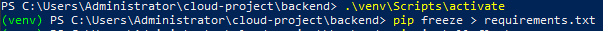
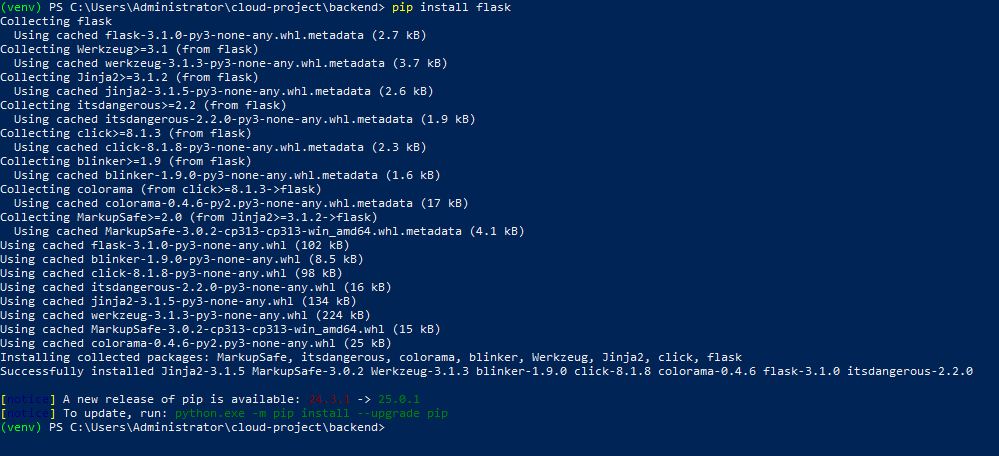
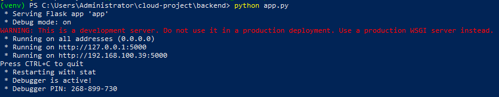
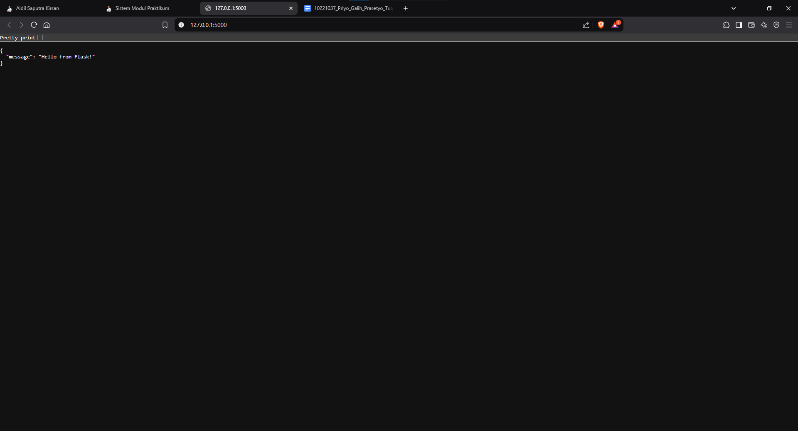
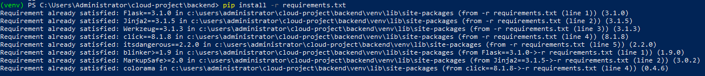

# Dokumentasi Praktikum - API Sederhana dengan Flask

## 📌 Deskripsi Singkat
Praktikum ini bertujuan untuk membuat API sederhana menggunakan Flask. Mahasiswa akan belajar tentang struktur dasar Flask, routing, dan cara menjalankan server lokal.

## 🎯 Tujuan Pembelajaran
- Memahami struktur folder dan best practice dalam pembuatan API Flask.
- Mampu membuat endpoint dasar dengan Flask.

## 📂 Struktur Direktori
Berikut adalah struktur direktori dalam proyek:

```
cloud-project/
├─ backend/
│  ├─ venv/
│  │  ├─ Include/
│  │  ├─ Lib/
│  │  ├─ Scripts/
│  │  ├─ pyvenv.cfg
│  ├─ .gitignore
│  ├─ app.py
│  ├─ requirements.txt
├─ db/
├─ frontend/
├─ images/  # Folder untuk gambar dokumentasi
│  ├─ virtual_env.png
│  ├─ flask_install.png
│  ├─ run_flask.png
├─ README.md
```

## 🔧 Langkah-Langkah Praktikum
### 1️⃣ Membuat Virtual Environment
```bash
cd cloud-project/backend
python -m venv venv
```
- **Windows:**
  ```bash
  venv\Scripts\activate
  #gunakan .\ didepan venv jika menjalankan di powershell
  ```
- Jika menggunakan PowerShell dan terjadi error, jalankan:
  ```powershell
  Set-ExecutionPolicy -Scope CurrentUser -ExecutionPolicy RemoteSigned
  ```

📸 **Bukti Virtual Environment berhasil dibuat:**


### 2️⃣ Menginstal Flask
```bash
pip install Flask
```
Jika terjadi error saat instalasi, coba:
```bash
pip install Flask --default-timeout=100
pip install Flask -i https://pypi.doubanio.com/simple
python -m pip install --upgrade pip
```

📸 **Bukti Flask berhasil diinstal:**


### 3️⃣ Membuat Aplikasi Flask
Buat file `app.py` di dalam folder `backend/` dengan isi berikut:
```python
from flask import Flask, jsonify

app = Flask(__name__)

@app.route('/')
def home():
    return jsonify({"message": "Hello from Flask!"})

if __name__ == '__main__':
    app.run(debug=True, host='0.0.0.0', port=5000)
```

### 4️⃣ Menjalankan Aplikasi Flask
```bash
python app.py
```
Buka browser ke [http://127.0.0.1:5000/](http://127.0.0.1:5000/) atau [http://localhost:5000/](http://localhost:5000/).

📸 **Bukti Flask Berjalan:**

---

---

### 5️⃣ (Opsional) Membuat `requirements.txt`
Untuk menyimpan dependensi proyek, jalankan:
```bash
pip freeze > requirements.txt
```
Untuk menginstal semua dependensi di komputer lain:
```bash
pip install -r requirements.txt
```

📸 **Bukti instalasi Requirements:**

---

## 📌 Penutup
Dengan mengikuti langkah-langkah di atas, API sederhana dengan Flask telah berhasil dibuat dan dijalankan. Jika ada pertanyaan atau kendala, silakan diskusikan! 🚀