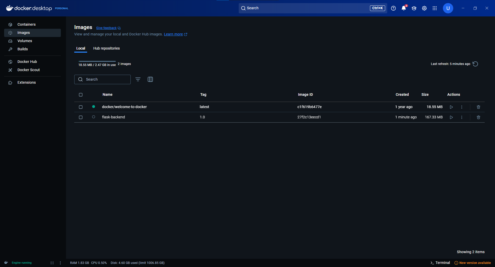

# Laporan Praktikum Docker

## 1. Pendahuluan

### a. Tujuan Praktikum

Praktikum ini bertujuan untuk:

1. Mempelajari dasar penggunaan Docker untuk membangun dan menjalankan aplikasi Flask.
2. Membuat Dockerfile yang dapat digunakan untuk membangun image Docker.
3. Menjalankan aplikasi Flask dalam sebuah container.
4. Memverifikasi bahwa aplikasi berjalan dengan baik di browser.

### b. Lingkungan Praktikum

- **Sistem Operasi:** Windows/Linux/MacOS
- **Software:** Docker Desktop, Terminal/Command Prompt, Browser
- **Bahasa Pemrograman:** Python 3.9
- **Framework:** Flask

## 2. Langkah-Langkah Praktikum

### a. Persiapan Awal

Sebelum memulai, pastikan Docker Desktop telah berjalan. Untuk mengeceknya, jalankan perintah berikut di terminal:

```sh
docker info
```

Jika Docker belum berjalan, pesan error seperti berikut akan muncul:

```sh
ERROR: error during connect: Get "http://%2F%2F.%2Fpipe%2FdockerDesktopLinuxEngine/v1.47/info": open //./pipe/dockerDesktopLinuxEngine: The system cannot find the file specified.
```

Untuk mengatasi ini, buka aplikasi **Docker Desktop** dan tunggu hingga status **"Docker is running"** muncul.

**Screenshot:** 

---

### b. Membuat Dockerfile

Buat file **Dockerfile** di dalam folder `backend` dengan isi sebagai berikut:

```Dockerfile
# backend/Dockerfile
FROM python:3.9-slim

WORKDIR /app

COPY requirements.txt requirements.txt
RUN pip install --no-cache-dir -r requirements.txt

COPY . .

EXPOSE 5000
CMD ["python", "app.py"]
```

Penjelasan singkat:

- **`FROM python:3.9-slim`** → Menggunakan image Python 3.9 versi slim.
- **`WORKDIR /app`** → Menentukan direktori kerja dalam container.
- **`COPY requirements.txt requirements.txt`** → Menyalin file requirements.txt.
- **`RUN pip install --no-cache-dir -r requirements.txt`** → Menginstal dependensi yang diperlukan.
- **`COPY . .`** → Menyalin semua file dari direktori lokal ke dalam container.
- **`EXPOSE 5000`** → Membuka port 5000 untuk aplikasi.
- **`CMD ["python", "app.py"]`** → Menjalankan aplikasi Flask.

---

### c. Menyiapkan requirements.txt

Buat file **requirements.txt** dengan isi sebagai berikut:

```txt
flask
flask-cors
psycopg2-binary
```

---

### d. Build Docker Image

Jalankan perintah berikut untuk membangun image Docker:

```sh
cd backend
docker build -t flask-backend:1.0 .
```

Jika proses berhasil, akan muncul pesan **"Successfully built"** pada terminal.

**Screenshot:** 

**Screenshot:** 

---

### e. Menjalankan Container

Setelah image berhasil dibuat, jalankan container dengan perintah berikut:

```sh
docker run -d -p 5000:5000 --name flask-container flask-backend:1.0
```

Untuk mengecek apakah container berjalan, gunakan perintah:

```sh
docker ps
```

Jika berhasil, container dengan nama **flask-container** akan muncul dalam daftar container yang sedang berjalan.

**Screenshot:** 

---

### f. Verifikasi di Browser

Buka browser dan akses **[http://localhost:5000](http://localhost:5000)**. Jika aplikasi berjalan dengan benar, halaman API Flask akan ditampilkan.

**Screenshot:** 

## 3. Hasil dan Bukti Praktikum

Berikut adalah bukti dokumentasi keberhasilan praktikum:

1. **Bukti Instalasi Docker**
   - 

2. **Docker Image Sukses Dibangun**
   - 
   - 

3. **Container Berjalan**
   - 
   - 

4. **Tampilan API Flask di Browser**
   - 

## 4. Kesimpulan

Dari praktikum ini, diperoleh kesimpulan bahwa:

1. Docker dapat digunakan untuk membangun dan menjalankan aplikasi Flask dengan efisien.
2. Dockerfile yang dibuat dapat menghasilkan image yang berfungsi tanpa error.
3. Container dapat berjalan dan mengakses API Flask melalui browser.
4. Semua langkah dapat dilakukan dengan sukses sesuai dengan kriteria penilaian.

---
