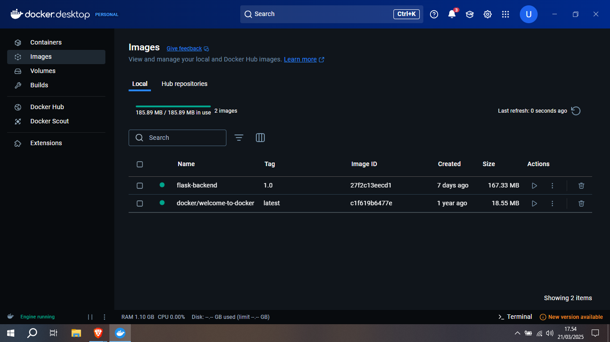
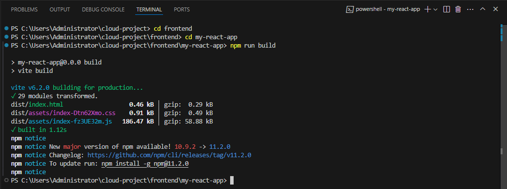
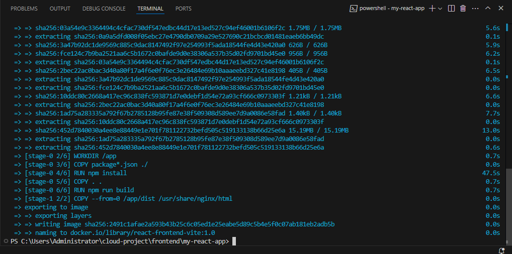
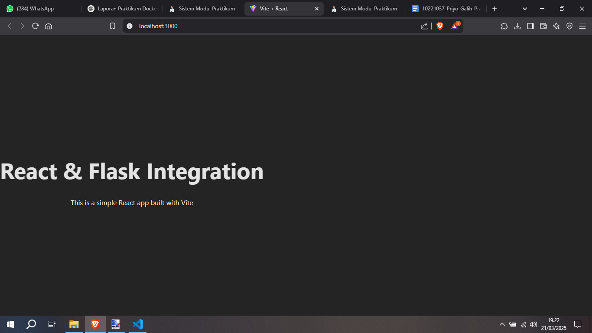

# Laporan Praktikum  
## Dockerization Bagian 2 (Membuat Dockerfile untuk React dengan Vite)  

```
Nama : Priyo Galih Prasetyo  
NIM  : 10221037  
```

> 📂 Repository dapat diakses di: [GitHub Repository](https://github.com/UstadzApuy/cloud_project)

##  Langkah-Langkah Praktikum  

### Persiapan Awal
- Pastikan Docker Desktop sudah berjalan.  
- Cek menggunakan perintah berikut:  
```bash
docker info
```
- Jika Docker sudah berjalan, akan tampil informasi seperti berikut:  



---

### Membuat Dockerfile
- Buat file `Dockerfile` di folder berikut:  
```
frontend/my-react-app/Dockerfile
```
- Isi file `Dockerfile` dengan:  
```dockerfile
# frontend/my-react-app/Dockerfile
FROM node:14-alpine

WORKDIR /app

COPY package*.json ./
RUN npm install

COPY . .

# Build untuk production menggunakan Vite
RUN npm run build

# Gunakan Nginx untuk serve static file
FROM nginx:stable-alpine
COPY --from=0 /app/dist /usr/share/nginx/html

EXPOSE 80
CMD ["nginx", "-g", "daemon off;"]
```

---

### Build Docker Image
- Jalankan build project terlebih dahulu:  
```bash
npm run build
```
- Berikut hasil build yang berhasil:  



- Lalu, pindah direktori:  
```bash
cd frontend/my-react-app
```
- Build Docker image dengan:  
```bash
docker build -t react-frontend-vite:1.0 .
```
- Hasil build image berhasil seperti berikut:  



---

### Menjalankan Docker Container
- Jalankan container menggunakan perintah:  
```bash
docker run -d -p 3000:80 --name react-container-vite react-frontend-vite:1.0
```

---

### Verifikasi di Browser
- Buka browser dan akses:  
```
http://localhost:3000
```
- Berikut tampilan aplikasi React Vite yang berjalan dari Docker container:  



---

## Hasil Praktikum
- Dockerfile untuk React Vite berhasil dibuat.  
- Image Docker berhasil dibangun.  
- Container berjalan dengan baik dan aplikasi dapat diakses melalui browser.  
- Semua langkah berjalan lancar tanpa error.

---
