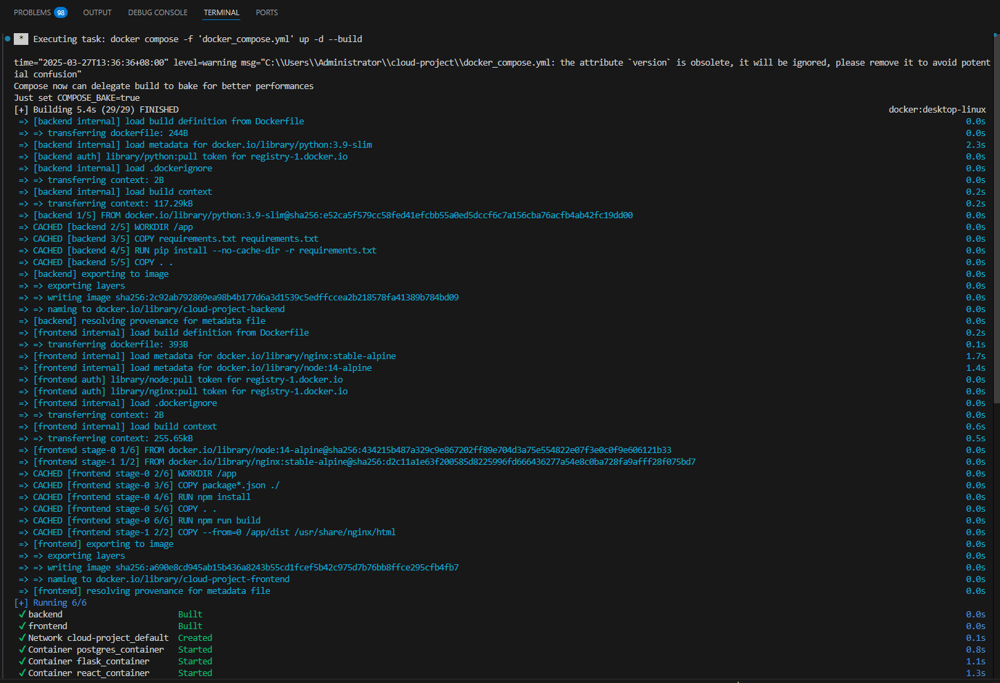
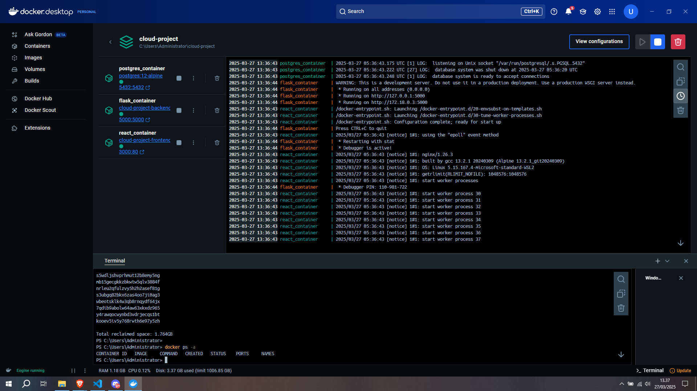
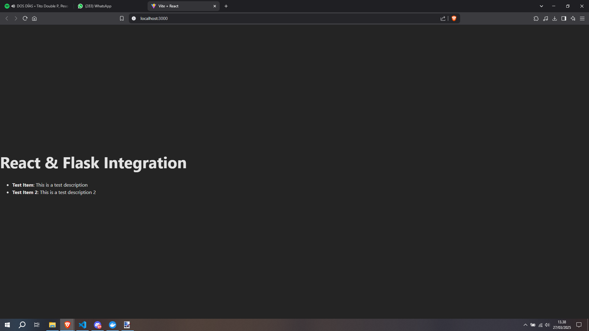

# Laporan Praktikum Pekan 8

## Identitas Mahasiswa
**Nama:** Priyo Galih Prasetyo  
**NIM:** 10221037  

**Link Repo:** [GitHub - cloud_project](https://github.com/UstadzApuy/cloud_project)

## PEKAN 8 – Integrasi Full Stack dengan Docker Compose (Review & Latihan Mandiri)

### 📄 Deskripsi Singkat
Ini adalah pekan review. Mahasiswa akan menggabungkan seluruh komponen (Flask, React, PostgreSQL) dalam satu `docker-compose.yml` untuk memudahkan orkestrasi.

### 🎯 Tujuan Pembelajaran
- Mahasiswa mampu membuat `docker-compose.yml` yang mengorkestrasi multi-container.
- Mahasiswa dapat melakukan review dan menyelesaikan latihan mandiri sebagai persiapan proyek.

### 👩‍💻 Pembagian Tugas Tim
- **Backend Engineer:** Menyesuaikan environment variable dan database connection di Compose.
- **Infrastructure Engineer:** Membuat file `docker-compose.yml` dan menguji integrasi.

## 🛠️ Langkah-Langkah Praktikum

### 1. Membuat `docker-compose.yml`
Buat file `docker-compose.yml` di folder `cloud-project` dengan isi berikut:

```yaml
version: '3.7'
services:
  backend:
    build: 
      context: ./backend
    container_name: flask_container
    ports:
      - "5000:5000"
    depends_on:
      - db
    environment:
      - DB_HOST=db
      - DB_NAME=test_db
      - DB_USER=student
      - DB_PASSWORD=password

  frontend:
    build:
      context: ./frontend/my-react-app
    container_name: react_container
    ports:
      - "3000:80"
    depends_on:
      - backend

  db:
    image: postgres:12-alpine
    container_name: postgres_container
    environment:
      - POSTGRES_DB=test_db
      - POSTGRES_USER=student
      - POSTGRES_PASSWORD=password
    ports:
      - "5432:5432"
    volumes:
      - db_data:/var/lib/postgresql/data
      - ./init.sql:/docker-entrypoint-initdb.d/init.sql

volumes:
  db_data:
```

### 2. Membuat File `init.sql`
Buat file bernama `init.sql` di folder `cloud-project` dengan isi berikut:

```sql
CREATE TABLE IF NOT EXISTS items (
    id SERIAL PRIMARY KEY,
    name VARCHAR(100) NOT NULL,
    description TEXT
);

INSERT INTO items (name, description) VALUES
('Test Item', 'This is a test description'),
('Test Item 2', 'This is a test description 2');
```

### 3. Menyesuaikan `app.py`
Gunakan environment variable untuk koneksi database:

```python
import os
import psycopg2
from flask import Flask, jsonify, request

# Fungsi untuk koneksi ke database PostgreSQL
def get_db_connection():
    conn = psycopg2.connect(
        host=os.environ.get("DB_HOST", "localhost"),
        database=os.environ.get("DB_NAME", "test_db"),
        user=os.environ.get("DB_USER", "student"),
        password=os.environ.get("DB_PASSWORD", "password")
    )
    return conn

app = Flask(__name__)

@app.route('/')
def home():
    return jsonify({"message": "Hello from Flask!"})

@app.route('/api/items', methods=['GET'])
def get_items():
    conn = get_db_connection()
    cur = conn.cursor()
    cur.execute("SELECT id, name, description FROM items;")
    rows = cur.fetchall()
    cur.close()
    conn.close()
    
    items = [{"id": row[0], "name": row[1], "description": row[2]} for row in rows]
    return jsonify(items)

@app.route('/api/items', methods=['POST'])
def create_item():
    data = request.json
    name = data['name']
    description = data['description']

    conn = get_db_connection()
    cur = conn.cursor()
    cur.execute("INSERT INTO items (name, description) VALUES (%s, %s) RETURNING id;", (name, description))
    new_id = cur.fetchone()[0]
    conn.commit()
    cur.close()
    conn.close()

    return jsonify({"id": new_id, "name": name, "description": description}), 201

if __name__ == '__main__':
    app.run(debug=True, host='0.0.0.0', port=5000)
```

### 4. Menyesuaikan `App.jsx` (Frontend)
Tambahkan error handling saat memuat data:

```jsx
import { useState, useEffect } from "react";

function App() {
  const [items, setItems] = useState([]);
  const [loading, setLoading] = useState(true);
  const [error, setError] = useState(null);

  useEffect(() => {
    fetch("http://localhost:5000/api/items")
      .then((response) => {
        if (!response.ok) {
          throw new Error("Network response was not ok");
        }
        return response.json();
      })
      .then((data) => {
        setItems(data);
        setLoading(false);
      })
      .catch((error) => {
        console.error("Error fetching data:", error);
        setError(error.message);
        setLoading(false);
      });
  }, []);

  if (loading) {
    return <div>Loading data...</div>;
  }

  if (error) {
    return <div>Error: {error}</div>;
  }

  return (
    <div>
      <h1>React & Flask Integration</h1>
      <ul>
        {items.map((item) => (
          <li key={item.id}>
            <strong>{item.name}</strong>: {item.description}
          </li>
        ))}
      </ul>
    </div>
  );
}

export default App;
```

### 5. Menjalankan Docker Compose
Jalankan perintah berikut untuk membangun dan menjalankan semua container:

```sh
docker compose up -d --build
```

#### 📸 Dokumentasi Gambar
- **Gambar proses `docker-compose up`:** 
- **Gambar Docker Compose berjalan di Docker Desktop:** 
- **Gambar Website yang sudah terhubung:** 

### 🛠 Solusi Error Loading Data
Jika mengalami error pada saat loading data di React, periksa riwayat build npm.  
**Solusi:** Hapus folder `dist` di `frontend/my-react-app` lalu rebuild dengan:
```sh
npm run build
docker compose up -d --build
```

Dengan langkah-langkah ini, integrasi full-stack dengan Docker Compose berjalan dengan lancar. 🚀

